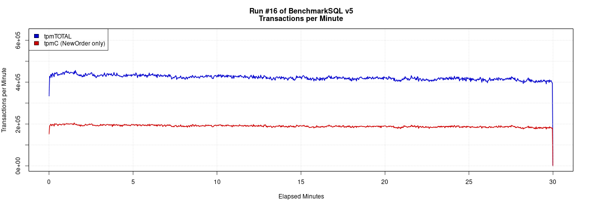
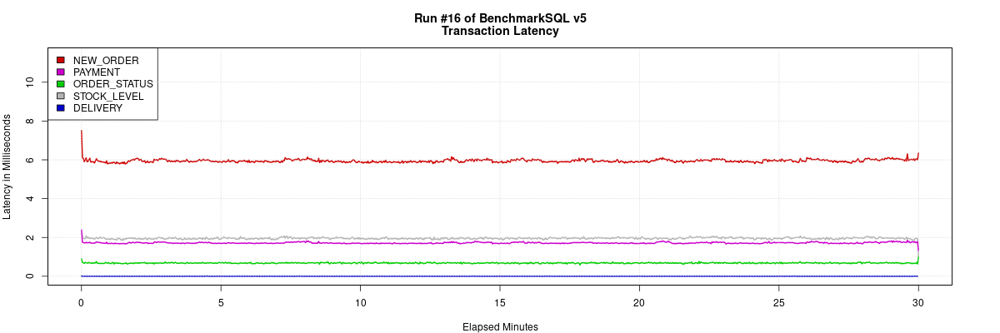

# BenchmarkSQL

BenchmarkSQL 是一个开源的 Java 应用程序，用于评估数据库系统在 OLTP 场景下的性能，它是符合 TPC-C 基准压力测试的工具。它最初由 HammerDB 的作者开发，后来由 Cloud V LLC 维护。

TPC-C 模型是模拟一个商品批发公司的销售模型，这个模型涵盖了一个批发公司面向客户对一系列商品进行销售的过程，这包括管理订单，管理库存，管理账号收支等操作。这些操作涉及到仓库、商品、客户、订单等概念，围绕这些概念，构造了数据表格，以及相应的数据库操作。

BenchmarkSQL 支持 MySQL（Percona、GreatSQL）、PostgreSQL、Oracle、SQL Server 等。

## 主要特性
- **标准化的测试**：基于 TPC-C 和 TPC-E 的标准基准测试，提供了一套公平的测试方案。
- **可扩展性**：支持多客户端并发测试，可以根据需要调整测试规模。
- **详细的报告**：测试完成后生成详细的性能报告，包括事务吞吐量、延迟、资源使用情况等。
- **跨平台**：由于基于 Java，BenchmarkSQL 可以在多种操作系统上运行。

## 如何使用 BenchmarkSQL 测试 GreatSQL

下面以 CentOS 8.x x86_64 环境为例，介绍如何安装配置使用 BenchmarkSQL。

### 1. 准备环境

**1. 下载 BenchmarkSQL**

建议选用 [GreatSQL社区修改后的 BenchmarkSQL 分支版本](https://gitee.com/GreatSQL/benchmarksql)，其好处有几点：

- 无需再做一次下面提到的修改调整；
- 增加支持MySQL/GreatSQL数据库；
- 增加MySQL连接驱动mysql-connector-j-8.0.33.jar；
- 修复在RR模式下测试结束后可能因为逻辑不严谨产生死循环问题（读取不到已被删除的数据导致逻辑判断错误）；
- 修改runDatabaseBuild.sh中的AFTER_LOAD的动作，无需再创建索引外键等操作。

用 git 客户端将代码下载到本地：

```bash
$ cd /usr/local
$ git clone https://gitee.com/GreatSQL/benchmarksql.git
$ cd benchmarksql
```
**2. 准备 Java 运行环境**

BenchmarkSQL 需要 Java 运行环境，确保系统中安装了 JDK 8 或更高版本。

此外，还要安装 Apache Ant，它是一个将软件编译、测试、部署等步骤联系在一起加以自动化的一个工具。用于编译 Benchmark SQL。

```bash
yum install -y java-1.8.0-openjdk ant
```

配置 Apache-Ant 的环境变量：

```bash
echo 'export ANT_HOME=/usr/share/ant-1.9.4' >> ~/.bash_profile
echo 'export PATH=${ANT_HOME}/bin:$PATH' >> ~/.bash_profile
source ~/.bash_profile
```

检查 Java 运行环境是否可用：

```bash
$ java -version
openjdk version "1.8.0_312"
OpenJDK Runtime Environment (build 1.8.0_312-b07)
OpenJDK 64-Bit Server VM (build 25.312-b07, mixed mode)

$ ant -version
Apache Ant(TM) version 1.10.5 compiled on June 24 2019
```

### 2. 配置 BenchmarkSQL

编辑配置文件 `run/props.mysql`，配置 GreatSQL 数据库的连接信息，例如数据库地址、端口、用户名和密码等。

```ini
db=mysql
driver=com.mysql.jdbc.Driver
conn=jdbc:mysql://localhost:3306/bmsql?allowPublicKeyRetrieval=true&useSSL=false&serverTimezone=GMT&useLocalSessionState=true&maintainTimeStats=false&useUnicode=true&characterEncoding=utf8&allowMultiQueries=true&rewriteBatchedStatements=true&cacheResultSetMetadata=true&metadataCacheSize=1024
user=bmsql
password=bmsql

warehouses=1000
loadWorkers=32

terminals=32
runTxnsPerTerminal=0
runMins=20
limitTxnsPerMin=0

terminalWarehouseFixed=true

newOrderWeight=45
paymentWeight=43
orderStatusWeight=4
deliveryWeight=4
stockLevelWeight=4

resultDirectory=my_result_%tY-%tm-%td_%tH%tM%tS
osCollectorScript=./misc/os_collector_linux.py
osCollectorInterval=1
```

主要参数说明
- `db=mysql`，指定数据库类型。
- `driver=com.mysql.jdbc.Driver`，指定驱动程序文件，这里是 MySQL JDBC 驱动。
- `conn`, `user`, `password`，指定 GreatSQL 数据库连接IP、端口、账号名、密码、默认数据库等。
- `warehouses`，指定仓库数，仓库数决定性能测试的成绩。对于高配服务器（32C96G以上），建议至少 1000 仓或更高。
- `loadWorkers`，指定加载数据时的并发数。如果是高配服务器，该值可以设置大一些，例如 100，一般和服务器的逻辑 CPU 核数一样即可。过高的并发可能会导致内存消耗太快，出现报错，导致数据加载需要重新进行。
- `terminals`，指定性能压测时的并发数。建议并发数不要高于服务器的逻辑 CPU 核数。否则可能产生过多锁等待。
- `runTxnsPerTerminal`，指定每个终端执行的事务数量。如果该参数配置为非0时，则 `runMins` 参数必须设置为0。
- `runMins`，指定性能测试持续的时间（分钟）。如果该值设置为非0值时，runTxnsPerTerminal参数必须设置为0。时间越久，越能考验数据库的性能和稳定性。建议不要少于 10 分钟，生产环境中机器建议不少于 1 小时。
- `limitTxnsPerMin`，每分钟事务总数限制，该参数主要控制每分钟处理的事务数，事务数受 `terminals` 参数的影响，`limitTxnsPerMin/terminals` 运算后结果值必须是正整数。
- `terminalWarehouseFixed`，终端和仓库的绑定模式，设置为 **true** 时可以运行 4.x 兼容模式，意思为每个终端都有一个固定的仓库。设置为 **false** 时可以均匀的使用数据库整体配置。TPC-C 规则要求每个终端都必须有一个绑定的仓库，所以一般使用默认值 **true**。
- 下面五个值的总和必须等于100，默认值为：45, 43, 4, 4，4 ，与 TPC-C 测试定义的比例一致，实际操作过程中，可以调整比重来适应各种场景。
  - `newOrderWeight=45`，新订单事务占总事务的45%。
  - `paymentWeight=43`，支付订单事务占总事务的43%。
  - `orderStatusWeight=4`，订单状态事务占总事务的4%。
  - `deliveryWeight=4`，到货日期事务占总事务的4%。
  - `stockLevelWeight=4`，查看现存货品的事务占总事务的4%。
- `resultDirectory`，压测期间收集系统性能数据的目录。
- `osCollectorScript`，操作系统性能收集脚本。
- `osCollectorInterval`，操作系统收集操作间隔（单位：秒），默认为1秒。
- `osCollectorSSHAddr`，需要收集系统性能的主机。
- `osCollectorDevices`，操作系统中被收集服务器的网卡名称和磁盘名称。

### 3. 运行 BenchmarkSQL 测试

**1. 初始化数据库**

创建测试数据库，相应的账户，以及授权：

```sql
greatsql> CREATE DATABASE bmsql;
greatsql> CREATE USER bmsql IDENTIFIED BY 'bmsql';
greatsql> GRANT ALL ON bmsql.* TO bmsql;
greatsql> SHOW GRANTS FOR bmsql;
+--------------------------------------------------+
| Grants for bmsql@%                               |
+--------------------------------------------------+
| GRANT USAGE ON *.* TO `bmsql`@`%`                |
| GRANT ALL PRIVILEGES ON `bmsql`.* TO `bmsql`@`%` |
+--------------------------------------------------+
```

运行 `run/runDatabaseBuild.sh`，创建测试数据表并填充数据。

```bash
$ cd /usr/local/benchmarksql/run
$ ./runDatabaseBuild.sh ./props.greatsql

# ------------------------------------------------------------
# Loading SQL file ./sql.mysql/tableCreates.sql
# ------------------------------------------------------------
Loading class `com.mysql.jdbc.Driver'. This is deprecated. The new driver class is `com.mysql.cj.jdbc.Driver'. The driver is automatically registered via the SPI and manual loading of the driver class is generally unnecessary.
create table bmsql_config (
cfg_name    varchar(30) primary key,
cfg_value   varchar(50)
);
...
Starting BenchmarkSQL LoadData

driver=com.mysql.jdbc.Driver
Loading class `com.mysql.jdbc.Driver'. This is deprecated. The new driver class is `com.mysql.cj.jdbc.Driver'. The driver is automatically registered via the SPI and manual loading of the driver class is generally unnecessary.
conn=jdbc:mysql://localhost:3306/bmsql
user=bmsql
password=***********
warehouses=5
loadWorkers=2
fileLocation (not defined)
csvNullValue (not defined - using default 'NULL')

Worker 000: Loading ITEM
Worker 001: Loading Warehouse      1
Worker 000: Loading ITEM done
...
# ------------------------------------------------------------
# Loading SQL file ./sql.mysql/indexCreates.sql
# ------------------------------------------------------------
...
# ------------------------------------------------------------
# Loading SQL file ./sql.mysql/buildFinish.sql
# ------------------------------------------------------------
Loading class `com.mysql.jdbc.Driver'. This is deprecated. The new driver class is `com.mysql.cj.jdbc.Driver'. The driver is automatically registered via the SPI and manual loading of the driver class is generally unnecessary.
-- ----
-- Extra commands to run after the tables are created, loaded,
-- indexes built and extra's created.
-- ----
```

测试数据加载完毕。

如果安装的Java运行时版本（JRE）太旧的话，可能会有类似下面的报错信息：

```log
# ------------------------------------------------------------
# Loading SQL file ./sql.mysql/tableCreates.sql
# ------------------------------------------------------------
Error: A JNI error has occurred, please check your installation and try again
Exception in thread "main" java.lang.UnsupportedClassVersionError: ExecJDBC has been compiled by a more recent version of the Java Runtime (class file version 61.0), this version of the Java Runtime only recognizes class file versions up to 52.0
    at java.lang.ClassLoader.defineClass1(Native Method)
    at java.lang.ClassLoader.defineClass(ClassLoader.java:756)
    at java.security.SecureClassLoader.defineClass(SecureClassLoader.java:142)
    at java.net.URLClassLoader.defineClass(URLClassLoader.java:473)
    at java.net.URLClassLoader.access$100(URLClassLoader.java:74)
    at java.net.URLClassLoader$1.run(URLClassLoader.java:369)
    at java.net.URLClassLoader$1.run(URLClassLoader.java:363)
    at java.security.AccessController.doPrivileged(Native Method)
    at java.net.URLClassLoader.findClass(URLClassLoader.java:362)
    at java.lang.ClassLoader.loadClass(ClassLoader.java:418)
    at sun.misc.Launcher$AppClassLoader.loadClass(Launcher.java:352)
    at java.lang.ClassLoader.loadClass(ClassLoader.java:351)
    at sun.launcher.LauncherHelper.checkAndLoadMain(LauncherHelper.java:621)
```

这种情况下，升级Java版本即可，可参考下面的操作：

```bash
# 先卸载旧版本
$ yum remove -y java-1.8.0-openjdk

# 搜索其他新版本
$ yum search java*openjdk
java-1.8.0-openjdk.x86_64 : OpenJDK 8 Runtime Environment
java-11-openjdk.x86_64 : OpenJDK 11 Runtime Environment
java-17-openjdk.x86_64 : OpenJDK 17 Runtime Environment

# 安装新版本
$ yum install -y java-17-openjdk.x86_64
```

再次编译java代码：

```bash
$ cd /usr/local/benchmarksql
$ ant
```

这样应该就可以了。

**2. 运行测试**

运行 `bin/runBenchmark.sh` 来开始压力测试。

**提示：**
> 
> 1. 运行 BenchmarkSQL 压测时，OSCollector 组件需要用到 Python 2.x，因此还需要先安装 Python 2.x（执行 `yum install -y python2`）。
>
> 2. 如果设置的 terminals 参数值较大的话，也就是压测并发数较大时，可能比较容易发生行锁等待超时，这时可以适当加大 GreatSQL 中的 `innodb_lock_wait_timeout` 参数值（例如 `SET GLOBAL innodb_lock_wait_timeout = 60`）。

```bash
$ cd /usr/local/benchmarksql/run
$ ./runBenchmark.sh ./props.greatsql

[main] INFO   jTPCC : Term-00,
[main] INFO   jTPCC : Term-00, +-------------------------------------------------------------+
[main] INFO   jTPCC : Term-00,      BenchmarkSQL v5.0
[main] INFO   jTPCC : Term-00, +-------------------------------------------------------------+
[main] INFO   jTPCC : Term-00,  (c) 2003, Raul Barbosa
[main] INFO   jTPCC : Term-00,  (c) 2004-2016, Denis Lussier
[main] INFO   jTPCC : Term-00,  (c) 2016, Jan Wieck
[main] INFO   jTPCC : Term-00, +-------------------------------------------------------------+
[main] INFO   jTPCC : Term-00,
[main] INFO   jTPCC : Term-00, db=mysql
[main] INFO   jTPCC : Term-00, driver=com.mysql.jdbc.Driver
[main] INFO   jTPCC : Term-00, conn=jdbc:mysql://localhost:3306/bmsql
[main] INFO   jTPCC : Term-00, user=bmsql
...
[main] INFO   jTPCC : Term-00, copied ./props.greatsql to my_result_2024-08-16_095115/run.properties
[main] INFO   jTPCC : Term-00, created my_result_2024-08-16_095115/data/runInfo.csv for runID 9
[main] INFO   jTPCC : Term-00, writing per transaction results to my_result_2024-08-16_095115/data/result.csv
[main] INFO   jTPCC : Term-00, osCollectorScript=./misc/os_collector_linux.py
...
Term-00, Running Average tpmTOTAL: 421384.59    Current tpmTOTAL: 83449452    Memory Usage: 1814MB / 3135MB
[Thread-15] INFO   jTPCC : Term-00,
[Thread-15] INFO   jTPCC : Term-00,
[Thread-15] INFO   jTPCC : Term-00, Measured tpmC (NewOrders) = 189675.86
[Thread-15] INFO   jTPCC : Term-00, Measured tpmTOTAL = 421368.54
[Thread-15] INFO   jTPCC : Term-00, Session Start     = 2024-08-16 10:40:10
[Thread-15] INFO   jTPCC : Term-00, Session End       = 2024-08-16 11:10:10
[Thread-15] INFO   jTPCC : Term-00, Transaction Count = 12641575
```

上述测试结果中
- `Measured tpmC (NewOrders)`，表示每分钟执行的事务数（只统计NewOrders事务）。
- `Measured tpmTOTAL`，表示每分钟平均执行事务数（所有事务）。
- `Transaction Count`，表示总事务数。

最终的性能测试结果是以 `Measured tpmTOTAL` 指标为准，也即通常所说的 **tpmC**（平均每分钟事务数）。

3. 清理数据库

测试完成后，运行 `bin/unDatabaseDestroy.sh` 来清理测试数据库。

```bash
$ cd /usr/local/benchmarksql/run
$ ./runDatabaseDestroy.sh ./props.greatsql

# ------------------------------------------------------------
# Loading SQL file ./sql.mysql/tableDrops.sql
# ------------------------------------------------------------
Loading class `com.mysql.jdbc.Driver'. This is deprecated. The new driver class is `com.mysql.cj.jdbc.Driver'. The driver is automatically registered via the SPI and manual loading of the driver class is generally unnecessary.
drop table bmsql_config;
drop table bmsql_new_order;
drop table bmsql_order_line;
drop table bmsql_oorder;
drop table bmsql_history;
drop table bmsql_customer;
drop table bmsql_stock;
drop table bmsql_item;
drop table bmsql_district;
drop table bmsql_warehouse;
drop sequence bmsql_hist_id_seq;
```

### 4. 查看结果

测试完成后，会生成测试结果文件，包括事务吞吐量、延迟、CPU 和内存使用情况等信息。

```bash
$ cd /usr/local/benchmarksql/run
$ ls -ltr | grep my_result
drwxr-xr-x 3 root root   40 Aug 16 09:51 my_result_2024-08-16_095115
$ cd my_result_2024-08-16_095115
$ ls -l
drwxr-xr-x. 2 root root  103 Aug 16 10:10 data
-rw-r--r--. 1 root root 1002 Aug 16 10:10 run.properties

$ ls -l data/
-rw-r--r--. 1 root root    15910 Aug 16 10:15 blk_md127.csv
-rw-r--r--. 1 root root    15268 Aug 16 10:15 net_em1.csv
-rw-r--r--. 1 root root 35529136 Aug 16 10:15 result.csv
-rw-r--r--. 1 root root      218 Aug 16 10:10 runInfo.csv
-rw-r--r--. 1 root root    34612 Aug 16 10:15 sys_info.csv
```

可以利用 `run/generateReport.sh` 生成图形化测试报告。

在此之前，需要先安装 R 语言运行环境。

```bash
yum install -y epel-release
yum makecache 
yum install -y R
```

生成测试报告：

```bash
$ cd /usr/local/benchmarksql/run
$ ./generateReport.sh ./my_result_2024-08-16_104010

Generating my_result_2024-08-16_104010/tpm_nopm.png ...  OK
Generating my_result_2024-08-16_104010/latency.png ... OK
Generating my_result_2024-08-16_104010/cpu_utilization.png ... OK
Generating my_result_2024-08-16_104010/dirty_buffers.png ... OK
Generating my_result_2024-08-16_104010/blk_md127_iops.png ... OK
Generating my_result_2024-08-16_104010/blk_md127_kbps.png ... OK
Generating my_result_2024-08-16_104010/net_em1_iops.png ... OK
Generating my_result_2024-08-16_104010/net_em1_kbps.png ... OK
Generating my_result_2024-08-16_104010/report.html ... OK

$ ls my_result_2024-08-16_104010/

blk_md127_iops.png  cpu_utilization.png  dirty_buffers.png  net_em1_iops.png  report.html     tpm_nopm.png
blk_md127_kbps.png  data                 latency.png        net_em1_kbps.png  run.properties
```

之后就可以在浏览器中打开测试报告了，就像这样：





## 总结

BenchmarkSQL 是一个强大且灵活的工具，用于评估数据库系统在 OLTP 场景下的性能。通过正确配置和优化，你可以得到数据库在特定工作负载下的详尽性能报告，这对于性能调优和容量规划非常有帮助。

**扫码关注微信公众号**


## BENCHMARKSQL README

CHANGE LOG:
-----------

Version 5.0 lussman & jannicash:
--------------------------------------
  +  Upgrade to PostgreSQL 9.3 JDBC 4.1 version 1102 driver
  +  Improve support for Oracle
  +  Re-implement the non-uniform random generator in TPC-C style.
  +  Conform to clause 4.3.3.1 and enable lookup by last name
  +  Add a switch to disable terminal-warehouse association, spreading
     the data access over all configured warehouses.
  +  Re-worked the run shell scripts and the location of SQL files to
     make support of more database types easier.
  +  Add support for Firebird (http://www.firebirdsql.org).
  +  Add FOREIGN KEYS as defined by TPC-C 1.3.
  +  Major code overhaul. The per transaction type terminal data
     generation, execution and terminal trace code is moved into a
     module jTPCCTData. The database connection with all prepared
     statements has moved into a module jTPCCConnection.
  +  Add collecting per transaction result data and OS Level
     resource usage collection. The R statistics package is used
     to graph detailed information and a complete report in HTML
     can be generated from the data.

Version 4.1.2 TBD jannicash:
-----------------------------------
  + Fixed one more preparedStatement() leak. Hopefully with the help
    of Oracle's V$OPEN_CURSOR view we got them all now.
  + Fixed a possible deadlock problem in the NEW_ORDER transaction.
    Multiple parallel transaction could attempt to lock the same
    STOCK rows in reverse order. Sorting the order lines by item ID
    avoids this problem.

Version 4.1.1 2016-01-31 jannicash:
-----------------------------------
  + Changed the status line to update only once per second. The previous
    implementation was getting rather noisy at high throughput.
  + Fixed two preparedStatement() leaks that could cause ORA-01000 errors
    on longer runs with high throughput.
  + Fixed  a problem in the calculation of sleep time between
    transactions when using limitTxnsPerMin that could cause the test
    to hang at the end.
  + Added support for escaping ; as \; in SQL files to be able to load
    functions and execute anonymous PL blocks (needed for next item).
  + Changed the definition of history.hist_id into a plain integer with
    no special functionality. Two new database vendor specific SQL
    scripts allow to enable the column after data load as an auto
    incrementing primary key. See HOW-TO-RUN.txt for details.

Version 4.1.0 2014-03-13 lussman:
---------------------------------
  + Upgrade to using JDK 7
  + Upgrade to PostgreSQL JDBC 4.1 version 1101 driver
  + Stop claiming to support DB2 (only Postgres & Oracle are well tested)

Version 4.0.9 2013-11-04 cadym:
-------------------------------
  + Incorporate new PostgreSQL JDBC 4 version 1100 driver
  + Changed default user from postgres to benchmarksql
  + Added id column as primary key to history table
  + Renamed schema to benchmarksql
  + Changed log4j format to be more readable
  + Created the "benchmark" schema to contain all tables
  + Incorporate new PostgreSQL JDBC4 version 1003 driver
  + Transaction rate pacing mechanism
  + Correct error with loading customer table from csv file
  + Status line report dynamically shown on terminal
  + Fix lookup by name in PaymentStatus and Delivery Transactions
    (in order to be more compatible with the TPC-C spec)
  + Rationalized the variable naming in the input parameter files
    (now that the GUI is gone, variable names still make sense)
  + Default log4j settings only writes to file (not terminal)

Version 4.0.2  2013-06-06   lussman & cadym:
--------------------------------------------
  + Removed Swing & AWT GUI so that this program is runnable from
    the command line
  + Remove log4j usage from runSQL & runLoader (only used now for
    the actual running of the Benchmark)
  + Fix truncation problem with customer.csv file
  + Comment out "BadCredit" business logic that was not working
    and throwing stack traces
  + Fix log4j messages to always show the terminal name
  + Remove bogus log4j messages

Version 3.0.9 2013-03-21  lussman:
----------------------------------
  + Config log4j for rotating log files once per minute
  + Default flat file location to '/tmp/csv/' in
    table copies script
  + Drop incomplete & untested Windoze '.bat' scripts
  + Standardize logging with log4j
  + Improve Logging with meaningful DEBUG and INFO levels
  + Simplify "build.xml" to eliminate nbproject dependency
  + Defaults read in from propeerties
  + Groudwork laid to eliminate the GUI
  + Default GUI console to PostgreSQL and 10 Warehouses

Version 2.3.5  2013-01-29  lussman:
-----------------------------------
  + Default build is now with JDK 1.6 and JDBC 4 Postgres 9.2 driver
  + Remove outdated JDBC 3 drivers (for JDK 1.5).  You can run as
    before by a JDBC4 driver from any supported vendor.
  + Remove ExecJDBC warning about trying to rollback when in
    autocommit mode
  + Remove the extraneous COMMIT statements from the DDL scripts
    since ExecJDBC runs in autocommit mode
  + Fix the version number displayed in the console

Versions 1.0 thru 2.2  2004 - 2012 lussman:
-------------------------------------------
  + Dare to Compare
  + Forked from the jTPCC project
